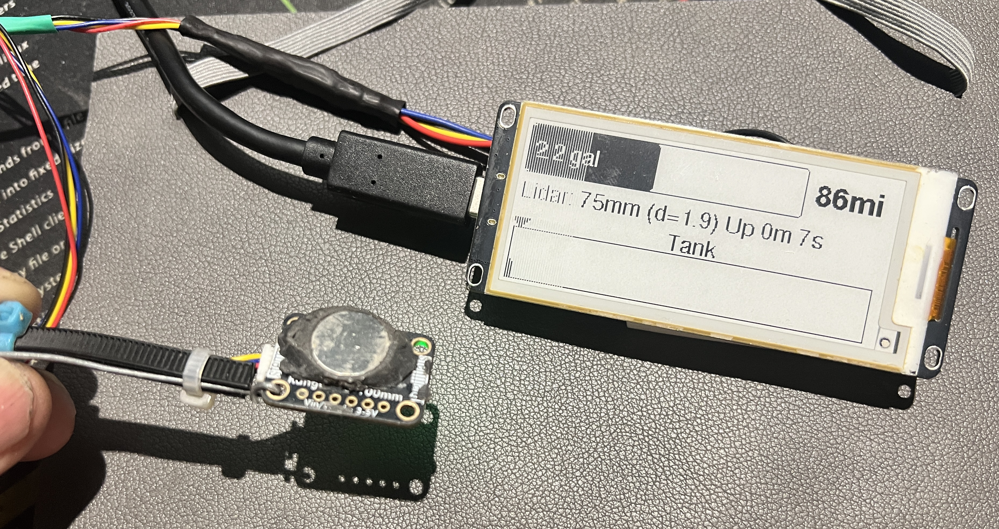
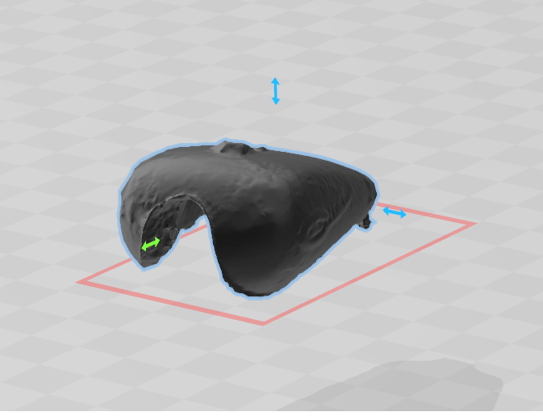

# ESP32 eInk+LiDAR Motorcycle Fuel Gauge

An ESP32-based fuel tank monitoring system using a LIDAR sensor and e-ink display. Designed for vehicle fuel level monitoring with real-time display of fuel percentage, remaining gallons, estimated range, and historical consumption data.



Here's the 3d scan of the fuel tank



## Project Structure

```
heltec-gas-gauge/
├── platformio.ini              # PlatformIO build configuration
├── src/
│   ├── main.cpp                # Main entry point
│   ├── classes/
│   │   ├── EinkDisplayTask.cpp     # E-ink display task
│   │   ├── MyTask.cpp          # FreeRTOS task base class
│   │   ├── TankCapacity.cpp    # Fuel volume calculations
│   │   └── VlxTask.cpp         # LIDAR sensor task (VL6180X)
│   └── README.md               # This file
└── stl/                        # 3D printable enclosure files
```

## Hardware Requirements

### Microcontroller
- **Heltec Vision Master E290** (ESP32-S3 based board with integrated e-ink display)
- 296x128 pixel e-ink display

### Sensor
- **Adafruit VL6180X** Time-of-Flight LIDAR sensor
- Range: 0-255mm
- Mounted above fuel tank to measure fuel level depth

### Pin Configuration
| Function | GPIO Pin |
|----------|----------|
| I2C SDA  | GPIO 39  |
| I2C SCL  | GPIO 38  |
| VEXT Power | GPIO 18 |

### Tank Configuration Defaults
| Parameter | Default Value |
|-----------|---------------|
| Full tank distance | 10mm |
| Empty tank distance | 152mm |
| Tank capacity | 4.5 gallons |
| Average MPG | 40 |
| Screen refresh interval | 10 seconds |

## Build Process (PlatformIO)

### Prerequisites
- [VS Code](https://code.visualstudio.com/) with [PlatformIO extension](https://platformio.org/install/ide?install=vscode)

### platformio.ini
```ini
[env:vision-master-e290]
platform = espressif32
board = heltec_wifi_lora_32_V3
framework = arduino
monitor_speed = 115200
monitor_filters = esp32_exception_decoder
board_upload.use_1200bps_touch = true
build_flags =
  -D ARDUINO_USB_CDC_ON_BOOT=1
  -D Vision_Master_E290
  -D CORE_DEBUG_LEVEL=4
```

### Log Levels (CORE_DEBUG_LEVEL)
| Value | Level | Shows |
|-------|-------|-------|
| 0 | None | Nothing |
| 1 | Error | `ESP_LOGE` only |
| 2 | Warn | `ESP_LOGE`, `ESP_LOGW` |
| 3 | Info | `ESP_LOGE`, `ESP_LOGW`, `ESP_LOGI` |
| 4 | Debug | All above + `ESP_LOGD` |
| 5 | Verbose | Everything including `ESP_LOGV` |

### Build and Upload
```powershell
pio run --target upload
```

### Monitor Serial Output
```powershell
pio device monitor
```

## Architecture

The system uses FreeRTOS to run two independent tasks:

| Task | Stack Size | Priority | Function |
|------|------------|----------|----------|
| VlxTask | 8192 bytes | 3 | Continuously samples LIDAR sensor (~20 samples/cycle) |
| EinkDisplayTask | 16384 bytes | 3 | Updates e-ink display periodically |

### Source Files

| File | Description |
|------|-------------|
| `main.cpp` | Main entry point, initializes tasks |
| `classes/VlxTask.cpp` | LIDAR sensor driver, calculates mean/stddev, maintains history buffer |
| `classes/EinkDisplayTask.cpp` | Renders fuel gauge, stats, and historical graph on e-ink |
| `classes/TankCapacity.cpp` | Converts distance readings to volume using tank geometry |
| `classes/MyTask.cpp` | FreeRTOS task wrapper base class |

### Data Flow
1. VlxTask reads 20 samples from VL6180X sensor per cycle
2. Calculates average distance and standard deviation
3. Stores result in 200-element ring buffer for history
4. EinkDisplayTask retrieves latest data via mutex-protected access
5. TankCapacity converts distance to volume (gallons/liters)
6. Display renders fuel gauge, statistics, and historical bar graph

## Display Features

- Current fuel level percentage with bar graph
- Remaining fuel volume (gallons)
- Estimated driving range (miles)
- 200-sample historical fuel level graph
- Sensor uptime and status
- Error messages for sensor failures

## Customization

Tank parameters can be set when creating the EinkDisplayTask:

```cpp
einkTask = new EinkDisplayTask(
    I2C_SDA, I2C_SCL,   // I2C pins
    vlxTask,            // Pointer to VlxTask
    10,                 // mmFullTank - distance when full
    152,                // mmEmptyTank - distance when empty
    4.5,                // galCapacity - tank capacity in gallons
    40,                 // mpgAvg - average fuel economy
    10                  // secRefresh - display refresh interval
);
```

## 3D Printed Enclosure

STL files for a custom enclosure are included in the `/stl/` directory:
- `E290 Bottom.stl` - Bottom housing
- `E290 Top.stl` - Top housing
- `E290 Buttons.stl` - Button interface

## Dependencies

Managed automatically by PlatformIO:
- `heltec-eink-modules` - Heltec e-ink display driver
- `Adafruit_VL6180X` - VL6180X LIDAR sensor driver
- `Adafruit_GFX` - Graphics library

## License

See LICENSE file for details.
